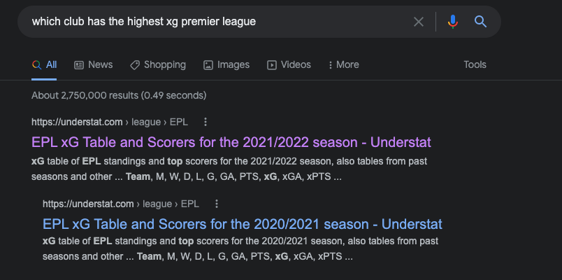
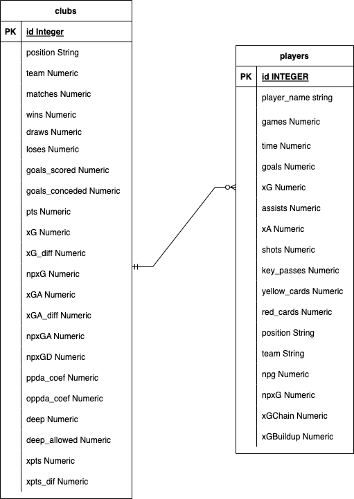
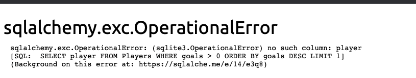

# Readme

I am going to build a minimal project that will allow a user to search for football statistics.

Google generally does a fantastic job of providing stats about football, i.e  how many goals has Salah scored this season? Will return something like this


This is great as you instantly get the information you need but what if you wanted to deeper, i.e something like which team/club has the highest xg in the premier league, you don't get the nice answer in browser, you get a link to a website like so



This idea/project is borne mostly of me wanting to explore some new technology I haven't used before which I think seems cool mostly gpt3

## Plan

The scope is going to be limited to the premier league and will contain information from this season. There may well be scope in the future to add additional leagues, and historic statistical information. The players will all be those currently with clubs. The initial iteration is going to use python virtual environments and pipenv. If you want to explore the project.

1. Clone the repo
2. Start a virtual environment in the root directory
3. Then run ```pip install -r requirements.txt``` in the virtual environment
4. You can access the database using SQL Alchemy or by using the following command ```sqlite ./db/football_stats.db``` from the root directory

### Data Model

The data model will be that of a minimal scope consisting of two tables Clubs and Players. The initial plan is displayed below consisting of three tables, Clubs, Players and Stats. The relationships are demonstrated below in an ERD diagram. This was before I explored the data.


With the thinking being that one club can have many players, one player can have more than one entry in the stat table by virtue of changing club etc, according to fifa rules, a player can only change teams three times within one season.

The original schema I envisioned is no longer fit for purpose, after exploring the data I realised the data was much richer data than I expected. In addition with the data available from understat, a seperate table for stats is not required. The new ERD is below.



One club can have many players, one player can have more than one entry(if they move clubs during the season etc)

The clubs table has been populated, the players table is empty, this is deliberate to get to a MVP before adding in the additional data. Once I'm ready to populate the database further and make changes to the schema, I am going to use alembic. This will allow me to migrate the schema to a required format and if there are any issues will also allow me the ability to roll the schemas back to earlier versions.

### Getting the Data

The data is provided via [understat](https://understat.com/), the data is JSON which needed some cleaning all of this is detailed in ```etl/transform.py```, initially did all the exploration in a jupyter notebook then abstracted the logic into mostly self contained functions, with a view to eventually using celery workers to call these functions. These functions are rough and will need some tidying up, will eventually add in some logging and docstrings.

Also added in some functionality to write the data to a JSON file to stop hammering the website with requests. If the data is present no request is made (detailed in ```main.py```), this could be further enhanced by suffixing a data identifier to the file path to ensure the most up to date data. In this current testing stage having the latest data isn't crucial.

All that's left to do is load the data, in the script I wrote the output to a csv file for a simple sense check. Once I'm happy with the data then will load the data into a sqlite database to allow GPT3 to run queries against it.

### GPT3

Then connecting up the GPT3 to build out the query side of things. The thinking here is that by leveraging gpt3's API we can generate SQL queries on the fly that will answer questions posed in a minimal flask app, all the code is stored in ```gpt3_app/``` follows a pretty standard flask setup. In order to run this and test the project yourself you can do the following(this assumes you already have your virtual environment activated)

1) ```cd gpt3_app/```
2) ```flask run``` (will run on port 5000, if port is in use can pass -p to specify an alternative port)
3) Enter your query and an answer will appear

GPT3 will generate some SQL and the project will run it and return your response from the database. If the question you ask, doesn't have an answer (or at the time of writing only one table present) you will get back a sqlalchemy error explaining the error like the below (I've cropped the image)



The error tells us what's wrong but we also see valid SQL code generated by GTP3, this error is because the table doesn't exist(at the time of writing). The question was "Who has scored the most goals?" 
