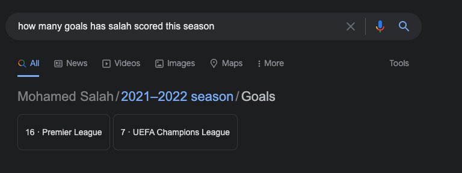
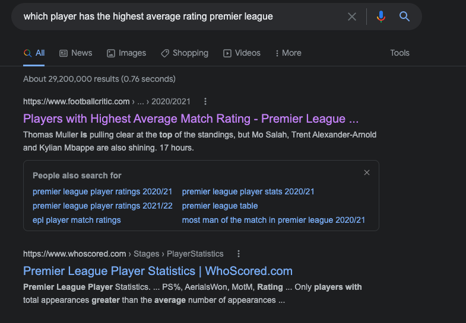
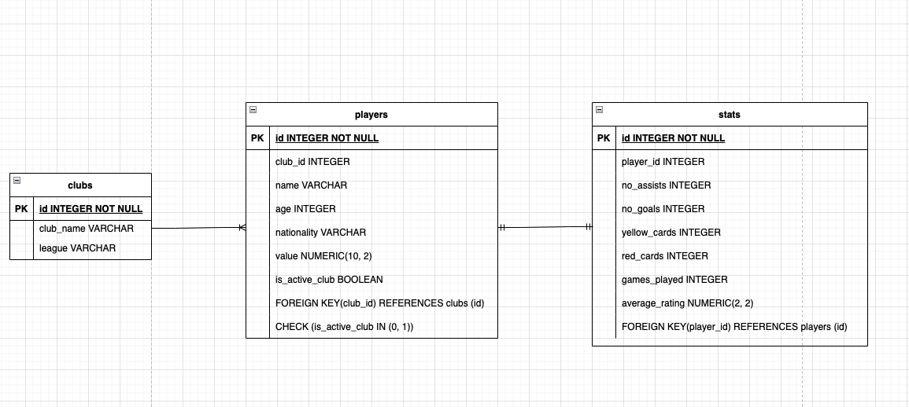

# Readme

I am going to build a minimal project that will allow a user to search for football statistics.

Google generally does a fantastic job of providing stats about football, i.e  how many goals has Salah scored this season? Will return something like this



This is great as you instantly get the information you need but what if you wanted to deeper, i.e something like which player has the highest average rating in the premier league, you don't get the nice answer in browser, you get a link to a website like so.



This idea/project is borne mostly of me wanting to explore some new technology I haven't

## Plan

The scope is going to be limited to the premier league and will contain information from this season. There may well be scope in the future to add additional leagues, and historic statistical information. The players will all be those currently with clubs. The initial iteration is going to use python virtual environments and pipenv. If you want to explore the project.

1. Clone the repo
2. Start a virtual environment
3. Then run ```pip install -r requirements.txt``` in your python virtual environment
4. You can access the database using SQL Alchemy or by using the following command ```sqlite football_stats.db```

The data model will also be initially that of a minimal scope consisting of three tables Clubs, Players and Stats. The relationships are demonstrated below in an ERD diagram.



One club can have many players, one player can only have one stat entry.

The database is currently empty, except for the tables in the data model. The data that will fill this database and tables is going to data that is scraped from sites with the relevant information using a combination of the requests and the beautiful soup modules in Python.

Once this is completed, some cleaning of the data is next then it can placed into our current sqlite database.

Then connecting up the GPT3 to build out the query side of things.

The data is provided via [understat](https://understat.com/), the data is JSON which needed some cleaning all of this is detailed in ```etl/transform.py```, initially did all the exploration in a jupyter notebook then abstracted the logic into mostly self contained functions, with a view to using celery workers to call these functions. These functions are rough and will need some tidying up, will add in some logging and docstrings.

Also added in some functionality to write the data to a JSON file to stop hammering the website with requests. If the data is present no request is made (detailed in ```main.py```), this could be further enhanced by suffixing a data identifier to the file path to ensure the most up to date data. In this current testing stage having the latest data isn't crucial.

All that's left to do is load the data, in the script I wrote the output to a csv file for a simple sense check. The original schema I envisioned is no longer fit for purpose, there was much richer data than I expected provided by understat. In addition with the data available from understat I don't think I'll need a separate table for statistics.

In order to manage these schema changes and migrations I am going to use alembic. This will allow me to migrate the schema to a required format and if there are any issues will also allow me the ability to roll the schemas back to earlier versions.
